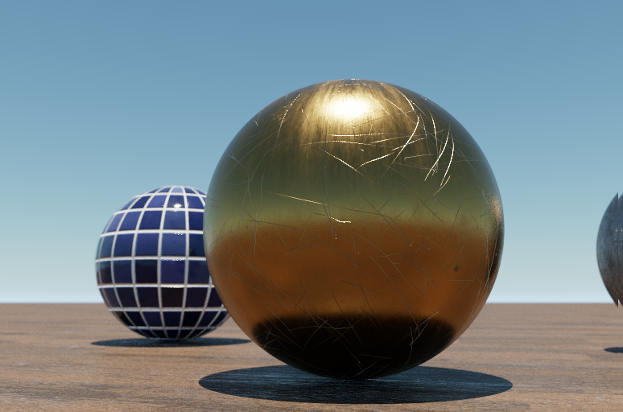

# RayTracer

Quick path tracer project written in C++ 

Features
- Lambert brdf for diffuse
- Cook-Torrance microfacet brdf for specular
- Uses OpenMP for multithreading
- Single-bounce atmospheric scattering model based on Elek
- Firefly reduction by limiting the roughness as the path bounces around
- Improved importance sampling for microfacet brdf
- Anti-aliasing
- Depth of field

Textures are licensed under CC0 and came from here: https://www.cgbookcase.com/downloads/
